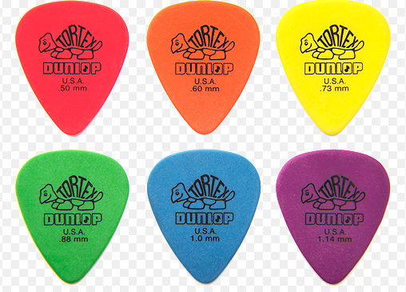

# Herramientas

## 1. Desarmadores o destornilladores

- Pala, plano
- Estrella, cruz
- Torx

Tornillos de seguridad:

## 2. Espatulas

- Plastico
- Metalicas

Puas para tocar guitarra

## 3. Pinzas

- Casos especiales

## 4. Llaves L o Bristol, Allen

## 5. Manilla antiestatica

